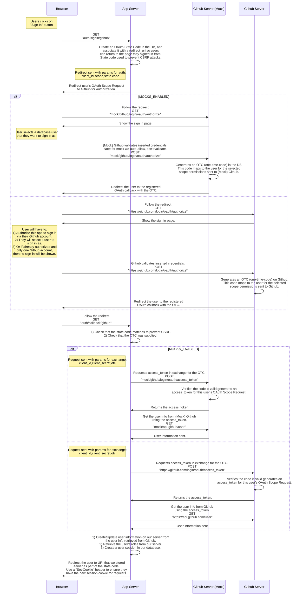

# Authentication System Design

The intended audience of this website would almost exclusively be developers, so using Github as an OAuth provider makes sense for authenticating users. There are some high level requirements for Authentication:

1. [Limited Logins](#limited-logins): Users should only need to log in once so long as they visit the site within a 90 day period of their last login. AKA sessions renew a 90 day lease on every refresh.
2. [Mocked Users](#mocked-users): The site should support having a pool of fake users for development and staging environments so that testing can be simulated with more than actual Github users.

## Limited Logins

There are a few ways to limit the number of times a user has to login. First I will present two common stragegies and then elaborate on the decision made, and some of the low level requirements for this design:

### Option 1: Long Server Sessions
The first way is to create a session token on the server that does not expire, or expires after a time much longer than the window for a user to sign back in. For example a session token on the server might not expire for 2 years, but the session cookie in the user's browser would have it's `Expires-At` attribute set to 90 days. Upon each request to the server we would add a `Set-Cookie` header to update the `Expires-At` of the cookie to 90 days, extending it's lifespan. As long as the session token stored in the server had not expired, we could update the cookie to extend it's lifespan:

**Pros:**
- We need to only make 1 request to the database to set a long duration session token.

**Cons:**
- The session cookie will expire after some time, when this happens the user will appear to still be logged in until they request a resource from the server.
- The long session cookies will collect in the database unnecessarily, the vast majority of session tokens will be unused.

### Option 2: Rolling Server Sessions

The second way is to create a session token on the server that expires in 90 days, and then send a `Set-Cookie` header to the browser with an `Expires-At` of 90 days too. Every request to the server will update the session token on the server, and it will update the cookie's `Expires-At` time. This is an example of a rolling session.

**Pros:**
- The session doesn't ever need to expire. A user could theoretically be signed in permanently such that they continue to visit the site within the `Expires-At` limit of the session/cookie.
- There will never be an instance where the user appears signed in on the browser, but is not when they request a resource from the server.
- The database won't fill up unnecessarily as we can put a TTL on the sessions corresponding with their expiration.

**Cons:**
- For every request we are performing not only a read to retrieve the session token, but also a write to update the token's `Expires-At` time. Doing this on every request is wasteful.

### Solution: Rolling Server Session w/ Restrictions

The solution to the problem is to use Rolling Sessions but only updating the server and browser `ttl` and `Expires-At` after a period of time has passed. We don't need to extend a user's session every time they make a server request as this puts unnecessary strain on the server, and it's very unlikely that the time inbetween requests is important to the user. With a lifespan of 90 days, we can limit the refresh of a sessions only 1 time in a 24 hour span. This allows for the benefits of the Rolling Server Sessions without the downfalls, and we won't run into any issues of filling out database up with unused items like the Long Server Sessions since out sessions will have much shorter lifespans.

One other issue of concern was how to update a server session when there are multiple requests in parallel? For example, when visiting a page in Remix there will be multiple parallel requests, a great feature of Remix. This presents the issue where each request will attempt to update the session which could cause race conditions. This issue is not that important however as the session ID (or key) will be the same regardless of the last request to update the session, and the `TTL`/`Expires-At` will be so close in time that the last `Set-Cookie` header's `Expires-At` may differ by probably a maximum of 1000ms.

This solution is implemented in the [entry.server.tsx](/packages/web/app/entry.server.tsx) file with the `refreshSession` function. For every document request we send (handled by `handleRequest` function) we will refresh the session, and for every data request we send (handled by `handleDataRequest` function) we will refresh the session. These functions are called AFTER a all other processing for the request has occurred, so we can check if there is already an attempt to set the session token - if not we will upate the TTL if appropriate.

Implementing rolling sessions is documented in more detail here: https://sergiodxa.com/articles/add-rolling-sessions-to-remix

```tsx
/**
 * This function will take in the request headers and response headers then compare the current time to the modified_at
 * time of the user's session. If the session has not been updated in more than 24 hours, we will update it to extend
 * the TTL. This allows a user to maintain a token for an unlimited period and not need to log back in such that they
 * continue to visit the site within 90d time windows.
 */
async function refreshSession(reqHeaders: Request["headers"], resHeaders: Response["headers"]) {
  const log = getLogger();

  const hasSession = await sessionCookie.parse(reqHeaders.get("cookie")).then((s) => !!s);
  const isSettingSession = !!parseCookie(SESSION_KEY, resHeaders.get("Set-Cookie") || "");

  if (hasSession && !isSettingSession) {
    // retrieve the session data
    const sesh = await session
      .getSession(reqHeaders.get("cookie"))
      .then(async ({ data }) => ZSession.parseAsync(data))
      .catch(async (e) => {
        log.warn(e, "Error: Session was malformed, deleting the session cookie.");
        resHeaders.append("Set-Cookie", await sessionCookie.serialize(""));
      });

    // if session older than 24h update it
    if (sesh) {
      const msSinceRefresh = new Date().getTime() - new Date(sesh.modified).getTime();
      if (msSinceRefresh > ms("24h")) {
        const sessionCookie = await session.commitSession(createSession(undefined, sesh.id));
        resHeaders.append("Set-Cookie", sessionCookie);
      }
    }
  }
}
```

## Mocking Users

One more feature that is great to have for development and testing is the ability to have mock users. With Github we would need to create a fleet of fake accounts to test users with different roles, or manually change roles of a couple users frequently. This is a cumbersome process and the abiliity to have mocked users would be best. Initially I had looked into using MSW (Mock Service Worker) to mock the requests to/from Github, but would need to ship the full MSW package to production/staging should I also wan't mock users in a staging environment.

The solution that I landed on was creating these mock routes as part of the app itself, protected by an environment variable that could be toggled! This way no additional package are shipped to production unnecessarily and all teh benefits of mocked users exist in any stage that is desired. Below is a sequence diagram showing how the Authentication works.


