# Theme

This document is about the design for the theme on this site and will discussing tracking the theme between visits, syncing cookie vs localStorage theme values, and the interface to update the theme.

There are many ways to implement themes on the web and there are pitfalls to some of these method. The requirements for the theme design on this site are:

- First time useres should see a dark mode on initial page flash, and then the system theme as the default afterwards.
- Users should have no flicker when performing a hard reload, or when performing a client-side navigation.
- User's theme choice should be remembered between visits.
- The user should be able to toggle between three themes: `system`, `dark`, and `light`.

## Tracking Site Theme

There are two common methods for keeping track of the site theme; localStorage and cookies. Most systems will track the site theme using just one of these two methods, however to meet all of the requirements we will need to use both. We need to use both because we have two environments to consider, server and client. The difference becomes an issue because the `system` theme is determined based upon the `prefers-color-scheme` media query, which is only available in the user's browser. This means our server must pick between only `dark` and `light` theme, which means we need to track the theme in two variables:

- `theme` - The actual theme which can be `system`, `dark`, or `light`. This will be stored in localStorage.
- `_theme` - The resolved theme which can be `dark` or `light`. This will be stored in a cookie.

```mermaid
flowchart TD
    %% Nodes
    Request

    subgraph Server
        %% Nodes
        ServerA("Parse '__preferences' cookie.")
        ServerB{"Cookie is valid?"}
        ServerD("Create cookie with<br/>default values.")
        ServerG("Add Set-Cookie header<br/>to update __preferences")
        ServerF("Initialize GlobalCtx on server<br/>with _theme")
        ServerH("SSR using new/updated _theme")

        %% Edges
        ServerA --> ServerB
        ServerB -- Yes --> ServerF
        ServerB -- No --> ServerD
        ServerD --> ServerG
        ServerG --> ServerF
        ServerF --> ServerH
    end

    subgraph Client
        %% Nodes
        ClientD("Display SSR Content")
        ClientA("Initialize GlobalCtx with<br/>SSR _theme value.")
        subgraph RestorePrefsEffect
            %% Nodes
            ClientB("Parse localStorage for<br/> __preferences key")
            ClientC{"localStorage<br/>is valid?"}
            ClientE("Set GlobalCtx.preferences<br/>to localStorage values.")
            ClientF("Set GlobalCtx.preferences<br/>to default values.")
            ClientG("Set GlobalCtx.isRestored<br/>to True.")

            %% Edges
            ClientC -- Yes --> ClientE
            ClientC -- No --> ClientF
            ClientE --> ClientG
            ClientF --> ClientG
        end
        ClientH{"Have any have changed:<br/>- preferences.isRestored<br/>- preferences.theme<br/>- mediaQuery(prefersDark)"}
        subgraph ResolvedThemeEffect
            %% Nodes
            ClientI("Compute new resolved _theme.")
            ClientJ("Set localStorage with new _theme.")
            ClientK("Set __preferences cookie with new theme.")
            ClientL("Set GlobalCtx._theme")

            %% Edges
            ClientI --> ClientJ
            ClientJ --> ClientK
            ClientK --> ClientL
        end
        ClientM("Render the page.")

        %% Edges
        ClientH -- Yes --> ClientI
        ClientH -- No --> ClientL
        ClientD --> ClientA
        ClientA --> ClientB
        ClientB --> ClientC
        ClientG --> ClientH
        ClientL --> ClientM
        ClientM -- React Event Loop --> ClientH

    end

    %% Edges
    Request --> ServerA
    ServerH -- Send SSR Content to Client --> ClientD

```

