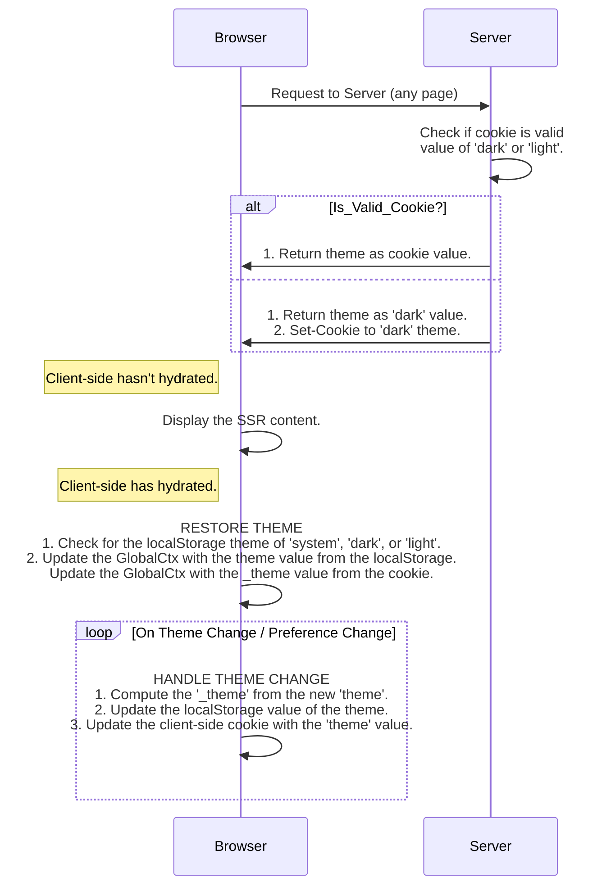
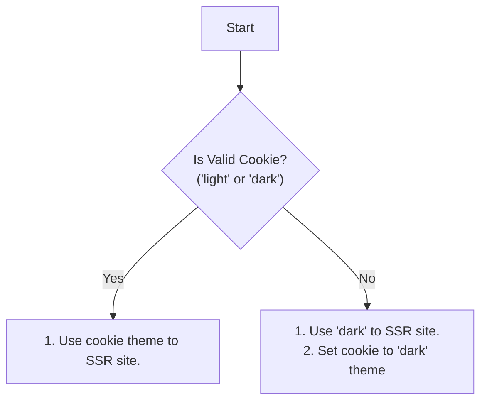

# Theme System Design

The main purpose of this design document will be about handling/syncing/keeping track of the theme for the user and not about specific style systems such as TailwindCSS that is used.

There are many ways to implement themes on the web, outlining the requirements here will help frame my decisions:

- First time users should see a dark mode on initial page flash, and then the system theme as the default afterwards.
- Users should have no flicker when performing a document reload or following a client-side link.
- Users theme choice should be remembered between visits.
- The user should be able to toggle between three themes: `system`, `dark`, and `light`.

## Tracking Site Theme

There are two common methods for keeping track of the site theme; localStorage and cookies. Most systems will track the site theme using just one of these two methods, however to meet all of the requirements we will need to use both. We need both because we have two environments to consider, server and client. This difference becomes an issue because the `system` theme is determined based upon the `prefers-color-scheme` media query, which is only available in the user's browser. This means our server must pick between only `dark` and `light` theme, which means we need to track the theme in two variables:

- `theme` - The actual theme which can be `system`, `dark`, or `light`. This will be stored in localStorage.
- `_theme` - The resolved theme which can be `dark` or `light`. This will be stored in a cookie.

By explaining the different environments and the information available to us we can show how the requirements will be satisfied with 4 scenarios:

- Server request without a valid cookie
- Server request with a valid cookie
- Browser hydration without valid localStorage
- Browser hydration with valid localStorage



### Server Request



```tsx
// FILE: packages/web/app/root.tsx
export async function loader({ request }: LoaderFunctionArgs) {
  logger(request);
  const resHeaders: HeadersInit = [];

  // Handle Cookie Theme
  // -------------------
  // Retrieves and parses the theme from the __preferences cookie. If the cookie is invalid or doesn't exist then
  // respond with a Set-Cookie to set the __preferences cookie. The theme will be used in SSR of the app.
  let prefs = await preferences.parse(request.headers.get("cookie"));
  if (!prefs) {
    prefs = { theme: "dark" };
    resHeaders.push(["Set-Cookie", await preferences.serialize(prefs)]);
  }

  return json({ theme: prefs.theme }, { headers: resHeaders });
}

function App() {
  const { theme } = useLoaderData<typeof loader>();

  // Handle Site Theme
  // -----------------
  // When the site is SSRed, the theme will be determined by the cookie returned from the server request. After
  // hydration the theme will be set from the value in the GlobalCtx.
  const [{ preferences }] = React.useContext(GlobalCtx);
  const calculatedTheme = useHydrated() ? preferences._theme : theme;

  return (
    <html lang="en" className={calculatedTheme}>
      <head>
        <meta charSet="utf-8" />
        <meta name="viewport" content="width=device-width, initial-scale=1" />
        <Meta />
        <Links />
      </head>
      <body className="grid min-h-[100dvh] grid-rows-[min-content_1fr_min-content] bg-slate-1">
        <ToasterProvider>
          <Header />
          <div className="justify-start">
            <Outlet />
          </div>
          <Footer />
          <ScrollRestoration />
          <Scripts />
          <LiveReload />
        </ToasterProvider>
      </body>
    </html>
  );
}
```

#### Server Request Without Valid Cookie

When a request comes to the server and either a `__preferences` cookie is not sent, or the cookie is malformed we will render the site with the dark theme and add a `Set-Cookie` header to instruct the user's browser to set the `__preferences` cookie. We want to use a dark theme when we aren't given a theme to render from the cookie because if a user is visiting the site at night then a bright flash of light (if we defaulted to light theme) would be annoying, but if a user visits in the daytime flashing of the dark theme is not too annoying.

#### Server Request With Valid Cookie

When a request comes to the server and the `__preferences` cookie is sent, we will simply use the theme value they sent to us in the cookie.

### Browser Hydration

```tsx
function useSiteThemeHandler(dispatch: React.Dispatch<Actions>, theme: IGlobalCtxState["preferences"]["theme"]) {
  // Restore Site Theme
  // ------------------
  // This effect restores the site theme from localStorage if it exists. If the theme was not saved to localStorage,
  // default it to 'system'. This effect also initializes the initial '_theme' from the '__preferences' cookie value.
  //
  // [Order-Dependent 1/2]
  React.useEffect(() => {
    let theme: IGlobalCtxState["preferences"]["theme"] = "system";
    let _theme: IGlobalCtxState["preferences"]["_theme"] = "dark";

    // update the 'theme' from localStorage
    try {
      // retrieve the preferences, base64 decode it, and parse for valid JSON
      let prefs = JSON.parse(atob(localStorage.getItem(PREFERENCES_KEY)!));

      // extract the theme
      theme = z.object({ theme: z.enum(["light", "dark", "system"]) }).parse(prefs).theme;
    } catch (e) {}

    // update the '_theme' from the cookie value
    try {
      // retrieve the preferences cookie, base64 decode it, and parse for valid JSON
      let prefs = JSON.parse(atob(Cookies.get(PREFERENCES_KEY)!));

      // extract the theme
      _theme = z.object({ theme: z.enum(["light", "dark"]) }).parse(prefs).theme;
    } catch (e) {}

    // update the context
    dispatch({ type: Types.PatchPreferences, payload: { theme, _theme } });
  }, []);

  // Compute Resolved Theme
  // ----------------------
  // After client-side hydration, this effect tracks and computes the resolved theme "_theme" in response to the "theme"
  // changing, or when the theme preferences is changed.
  //
  // (1) Determine and upate the new 'globalCtx.preferences._theme'
  // (2) Store the new theme in the '__preferences' localStorage key
  // (3) Update the '__preferences' cookie
  //
  // [Order-Dependent 2/2]
  const prefersDark = useMedia("(prefers-color-scheme: dark)", true);
  const isHydrated = useHydrated();

  React.useEffect(() => {
    if (isHydrated) {
      // determine the new resolved theme: _theme
      let _theme: typeof theme = "dark";
      if (theme === "light" || (theme === "system" && !prefersDark)) _theme = "light";

      // update localStorage and cookies
      localStorage.setItem(PREFERENCES_KEY, btoa(JSON.stringify({ theme })));
      Cookies.set(PREFERENCES_KEY, btoa(JSON.stringify({ theme: _theme })), {
        "Max-Age": String(ms("400d")),
        secure: false,
        domain: new URL(window.location.href).hostname.replace(/\:d+$/, ""),
        path: "/",
        sameSite: "lax",
      });

      // update context
      dispatch({ type: Types.PatchPreferences, payload: { _theme } });
    }
  }, [theme, prefersDark, isHydrated]);
}
```

#### Browser Hydration Without Valid localStorage

When the inital response comes from the server the client is not loaded, in this case we will display the content generated on the server. After the client hydrates we will run a `useEffect` in the `GlobalCtx` which sets the intial value for `theme` and `_theme`. If there is not a valid localStorage value for the theme we will set it to a default of `system` and the default `_theme` value will be set to the value from the cookie.

One more hook runs on the client in response to any change in the `theme` and `prefers-color-scheme`. Since we have just updated the `theme`, we now recompute what the `_theme` should be.

#### Browser Hydration With Valid localStorage

When the initial response comes from the server the client is not loaded, in this case we will display the content generated on the server. After the client hydrates we will run a `useEffect` in the `GlobalCtx` which sets the inital value for `theme` and `_theme`. If there is a valid localStorage value for the theme will set it to `system` and the `_theme` will be set to the value of the cookie.

One more hook runs on the client in response to any change in the `theme` and `prefers-color-scheme`. Since we have just updated the `theme`, we now recompute what the `_theme` should be.
