# Theme

This document is about the design for the theme on this site and will discussing tracking the theme between visits, syncing cookie vs localStorage theme values, and the interface to update the theme.

There are many ways to implement themes on the web and there are pitfalls to some of these method. The requirements for the theme design on this site are:

- First time useres should see a dark mode on initial page flash, and then the system theme as the default afterwards.
- Users should have no flicker when performing a hard reload, or when performing a client-side navigation.
- User's theme choice should be remembered between visits.
- The user should be able to toggle between three themes: `system`, `dark`, and `light`.

## Tracking Site Theme

There are two common methods for keeping track of the site theme; localStorage and cookies. Most systems will track the site theme using just one of these two methods, however to meet all of the requirements we will need to use both. We need to use both because we have two environments to consider, server and client. The difference becomes an issue because the `system` theme is determined based upon the `prefers-color-scheme` media query, which is only available in the user's browser. This means our server must pick between only `dark` and `light` theme, which means we need to track the theme in two variables:

- `theme` - The actual theme which can be `system`, `dark`, or `light`. This will be stored in localStorage.
- `_theme` - The resolved theme which can be `dark` or `light`. This will be stored in a cookie.

The following diagram shows the flow from a request to the server actions, and then onto the client actions.

### Server

The server recieves the `__preferences` cookie which holds the `type _theme = "dark" | "light"`. It will use the `_theme` (if it exists) for SSR of the content before it is sent to the client.

### Client

The client first shows the SSR content on the page. After hydration, the client will check localStorage for an item with key `__preferences`. This object will hold the `type theme = "dark" | "light" | "system"`. If this value exists, it will update the GlobalCtx with the restored theme value, compute the new `_theme`, and then render the page with the updated `_theme` value.

During this process, it will also update hte `__preferences` localStorage and `__preferences` cookie.

```mermaid
flowchart TD
    %% Nodes
    Request

    subgraph Server
        %% Nodes
        ServerA("Parse '__preferences' cookie.")
        ServerB{"Cookie is valid?"}
        ServerD("Create cookie with<br/>default values.")
        ServerG("Add Set-Cookie header<br/>to update __preferences")
        ServerF("Initialize GlobalCtx on server<br/>with _theme")
        ServerH("SSR using new/updated _theme")

        %% Edges
        ServerA --> ServerB
        ServerB -- Yes --> ServerF
        ServerB -- No --> ServerD
        ServerD --> ServerG
        ServerG --> ServerF
        ServerF --> ServerH
    end

    subgraph Client
        %% Nodes
        ClientD("Display SSR Content")
        ClientA("Initialize GlobalCtx with<br/>SSR _theme value.")
        subgraph RestorePrefsEffect
            %% Nodes
            ClientB("Parse localStorage for<br/> __preferences key")
            ClientC{"localStorage<br/>is valid?"}
            ClientE("Set GlobalCtx.preferences<br/>to localStorage values.")
            ClientF("Set GlobalCtx.preferences<br/>to default values.")
            ClientG("Set GlobalCtx.isRestored<br/>to True.")

            %% Edges
            ClientC -- Yes --> ClientE
            ClientC -- No --> ClientF
            ClientE --> ClientG
            ClientF --> ClientG
        end
        ClientH{"Have any changed:<br/>- preferences.isRestored<br/>- preferences.theme<br/>- mediaQuery(prefersDark)"}
        subgraph ResolvedThemeEffect
            %% Nodes
            ClientY{"GlobalCtx.isRestored<br/>is True?"}
            ClientI("Compute new resolved _theme.")
            ClientJ("Set localStorage with new _theme.")
            ClientK("Set __preferences cookie with new theme.")
            ClientL("Set GlobalCtx._theme")

            %% Edges
            ClientY -- Yes --> ClientI
            ClientI --> ClientJ
            ClientJ --> ClientK
            ClientK --> ClientL
        end
        ClientM("Render the page.")

        %% Edges
        ClientH -- Yes --> ClientY
        ClientH -- No --> ClientM
        ClientY -- No --> ClientM
        ClientD -- Client Hydrates --> ClientA
        ClientA --> ClientB
        ClientB --> ClientC
        ClientG --> ClientH
        ClientL --> ClientM
        ClientM -- React Event Loop --> ClientH

    end

    %% Edges
    Request --> ServerA
    ServerH -- Send SSR Content to Client --> ClientD
```



## Implementation

The way things are implemented can get tricky as we need to worry about a few different contexts. First we have the server context, then the client context, and then the React context.

From the diagram the request first comes to the server and we return the `prefs` which contains the `_theme` value for SSR and optionally a `Set-Cookie` header:

```tsx
// app/root.tsx
export async function loader({ request }: LoaderFunctionArgs) {
  const resHeaders: HeadersInit = [];

  // Handle Preferences Cookie
  // -------------------------
  // Retrieves and parses the theme from the __preferences cookie. If the cookie is invalid or doesn't exist then
  // respond with a a Set-Cookie to set the __preferences cookie. The theme will be used in SSR of the app.
  let prefs = await preferences
    .parse(request.headers.get("cookie"))
    .catch(() => null);
  if (!prefs) {
    prefs = { _theme: "dark", _codeTheme: "dark" };
    resHeaders.push(["Set-Cookie", await preferences.serialize(prefs)]);
  }

  return json({ prefs }, { headers: resHeaders });
}
```

Next we will SSR the content by passing the `prefs._theme` to the `GlobalCtxProvider` as a prop. Note that `useEffect` will only run on the client, but React context components will run on both the client and server.

```tsx
function _Layout({ children }: { children: React.ReactNode }) {
  const [{ preferences }] = React.useContext(GlobalCtx); // <-- Get the theme from GlobalCtx

  return (
    {/* Set the site theme! */}
    <html lang="en" className={preferences._theme}>
      <head>
        <meta charSet="utf-8" />
        <meta name="viewport" content="width=device-width, initial-scale=1" />
        <Meta />
        <Links />
      </head>
      <body className="grid min-h-[100dvh] grid-rows-[min-content_1fr_min-content] bg-slate-1 dark:bg-slatedark-1">
        <Header isAdmin={true} />
        <div className="justify-start">{children}</div>
        <Footer />
        <ScrollRestoration />
        <Scripts />
      </body>
    </html>
  );
}

export function Layout({ children }: { children: React.ReactNode }) {
  const { prefs } = useLoaderData<typeof loader>();

  return (
    {/* Initialize the _theme with SSR value! */}
    <GlobalCtxProvider _theme={prefs._theme}>
      <_Layout children={children} />
    </GlobalCtxProvider>
  );
}
```

Finally if we inspect the `GlobalCtxProvider` we can see that there is a `useEffect` hook to restore the theme and to track+update whenever the theme changes:

```tsx
export function GlobalCtxProvider({
  _theme,
  _codeTheme,
  children,
}: GlobalCtxProviderProps) {
  // Define the state of the context and ensure that the _theme and _codeTheme from the cookie are injected as part of
  // the initial value, or else there will be theme flashes.
  const [state, dispatch] = React.useReducer(reducer, {
    ...InitialGlobalCtxState,
    preferences: { ...InitialGlobalCtxState.preferences, _theme, _codeTheme },
  });

  // run the effects
  useSitePreferences(dispatch, state.preferences);

  return (
    <GlobalCtx.Provider value={[state, dispatch]}>
      {children}
    </GlobalCtx.Provider>
  );
}

/* ------------------------------------------------------------------------------------------------------------------
 * Define Hooks
 * ------------------------------------------------------------------------------------------------------------------ */

function useSitePreferences(
  dispatch: React.Dispatch<Actions>,
  preferences: IGlobalCtxState["preferences"]
) {
  // Restore Preferences
  // -------------------
  // This effect restores the 'preferences' from localStorage if it exists. If the 'preferences' are not stored in the
  // localStorage it will be defaulted to 'system'.
  React.useEffect(() => {
    let prefs: Payload[Types.PatchPreferences] | null = null;

    try {
      // retrieve the preferences, base64 decode them, and parse for valid JSON
      let localStoragePrefs = JSON.parse(
        atob(localStorage.getItem(PREFERENCES_KEY) || "")
      );
      // update the preferences if they are valid, throw if not
      prefs = {
        isRestored: true,
        ...ZGlobalCtxState.shape.preferences.partial().parse(localStoragePrefs),
      };
    } catch (e) {
      // set the default preferences if the localStorage preferences are invalid
      prefs = {
        isRestored: true,
        theme: preferences.theme,
        codeTheme: preferences.codeTheme,
      };
    }

    // update the context
    dispatch({ type: Types.PatchPreferences, payload: prefs });
  }, []);

  // Compute Resolved Theme
  // ----------------------
  // After the site preferences are restored, this effect tracks the "theme" and "codeTheme" and computes the "_theme"
  // and "_codeTheme" based on the "theme" and "codeTheme" respectively.
  const prefersDark = useMedia("(prefers-color-scheme: dark)", true);

  React.useEffect(() => {
    if (preferences.isRestored) {
      // determine the new resolved theme: _theme & _codeTheme
      let _theme: typeof preferences.theme = "dark";
      if (
        preferences.theme === "light" ||
        (preferences.theme === "system" && !prefersDark)
      )
        _theme = "light";

      let _codeTheme: typeof preferences.codeTheme = "dark";
      if (
        preferences.codeTheme === "light" ||
        (preferences.codeTheme === "system" && _theme !== "dark")
      )
        _codeTheme = "light";

      // update localStorage and cookies
      localStorage.setItem(
        PREFERENCES_KEY,
        btoa(
          JSON.stringify({
            theme: preferences.theme,
            codeTheme: preferences.codeTheme,
          })
        )
      );
      Cookies.set(
        PREFERENCES_KEY,
        btoa(JSON.stringify({ _theme, _codeTheme })),
        {
          "Max-Age": String(ms("400d")),
          secure: false,
          domain: new URL(window.location.href).hostname.replace(/\:d+$/, ""),
          path: "/",
          sameSite: "lax",
        }
      );

      // update context
      dispatch({
        type: Types.PatchPreferences,
        payload: { _theme, _codeTheme },
      });
    }
  }, [
    preferences.isRestored,
    preferences.theme,
    preferences.codeTheme,
    prefersDark,
  ]);
}
```
